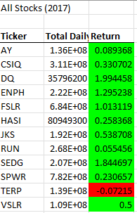
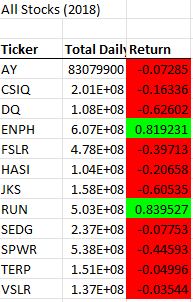
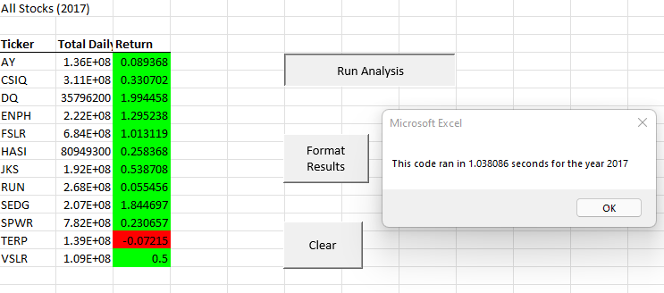
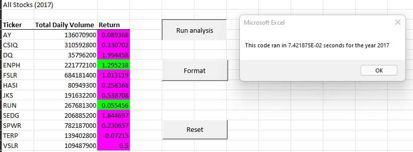
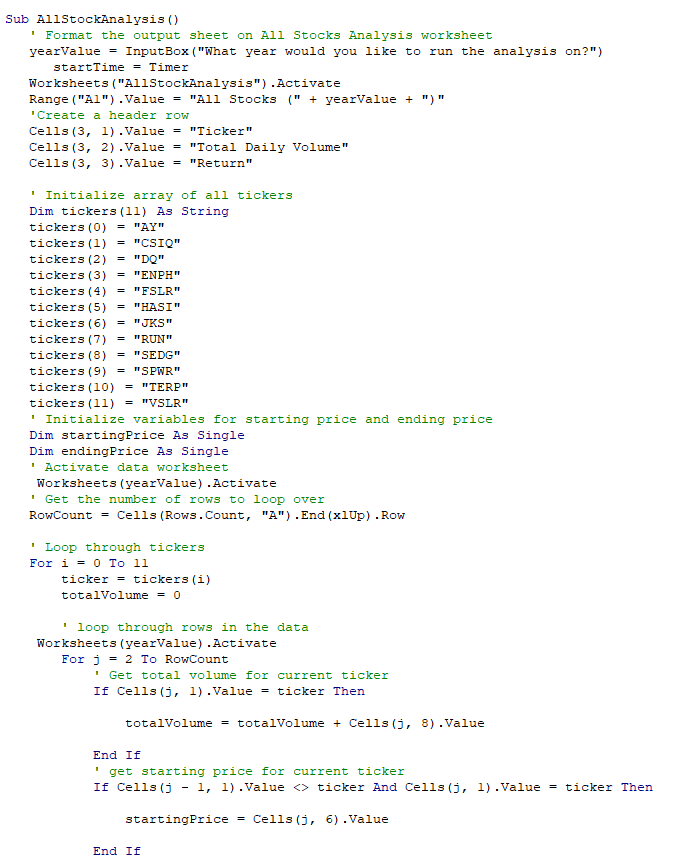
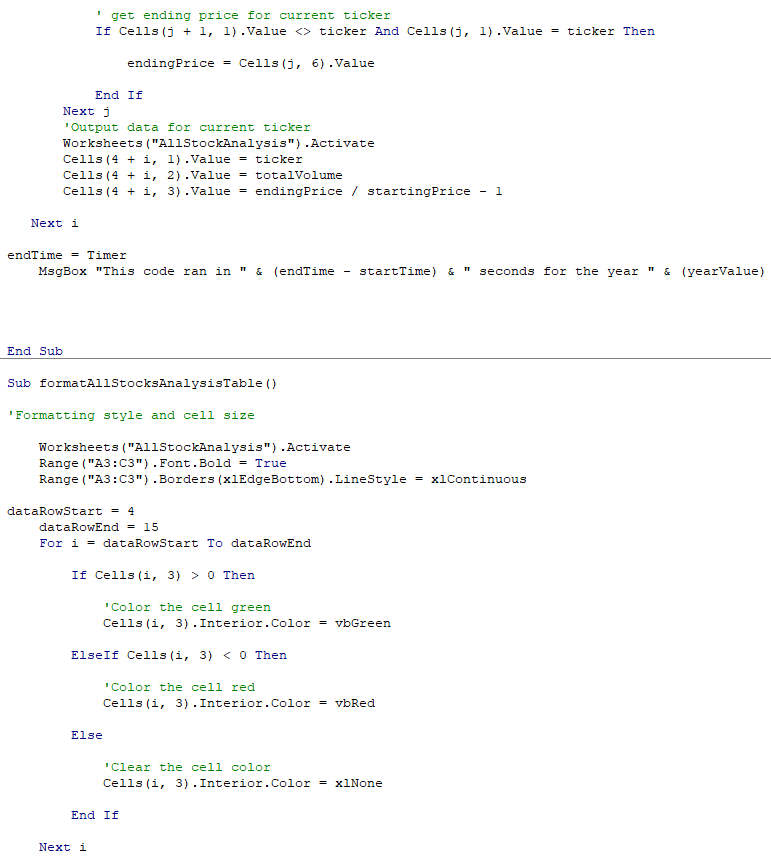
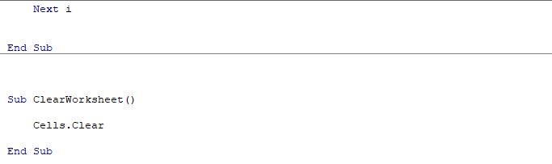
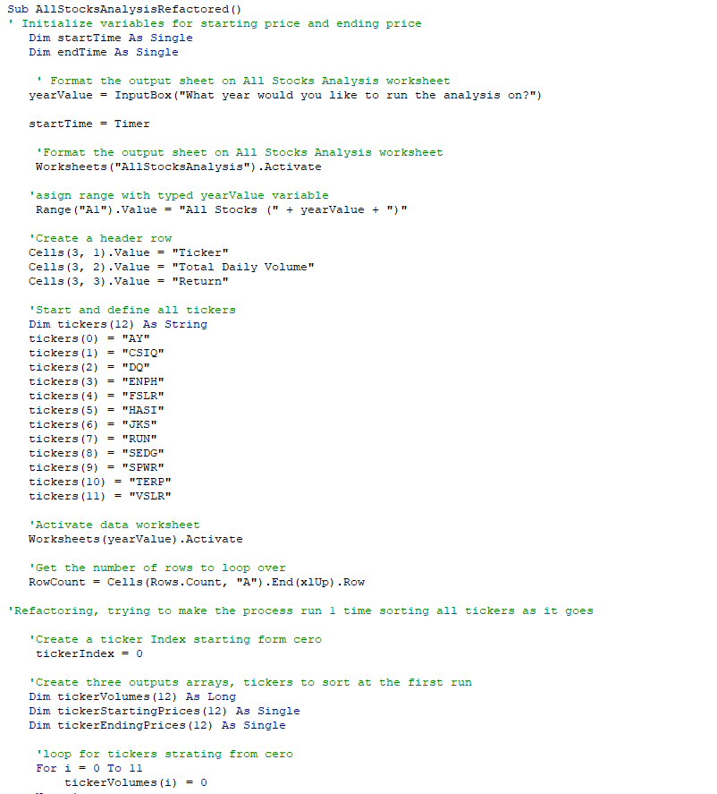
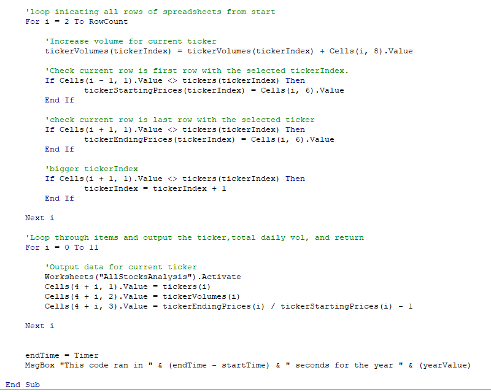
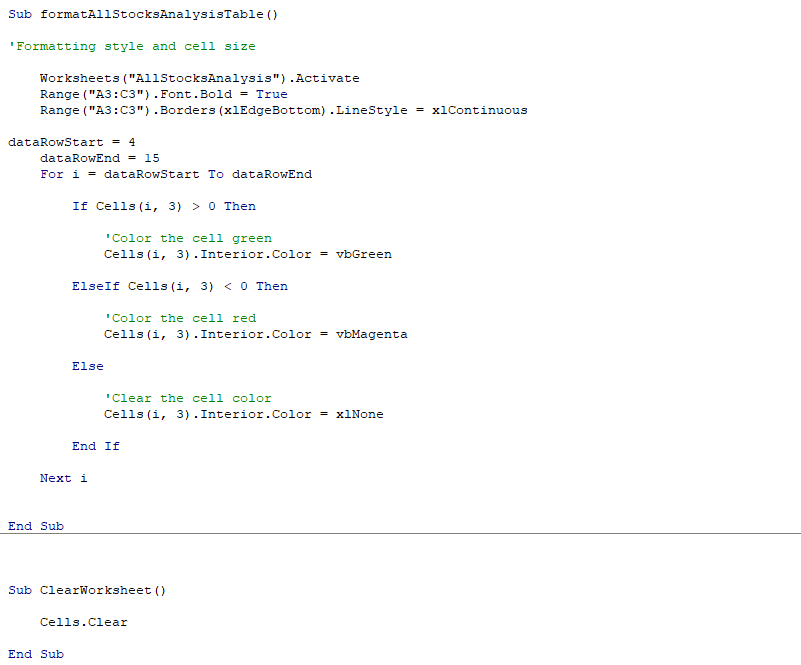

# stock-analysis
Module 2 analysis proyect

Full excel Files link: 
[Tickerschallengebasic](green_stocks_slow.xlsm) 
[TickerschallengeRefactored]( green_stocks_slow.xlsm)
## Overview of Project
 
The former project was done to help our clients to have e better understanding of stock tickers. Having a more accurate understanding of the behaviour of this is highly beneficial to take decisions based on objective data and not the gut feeling of how the stocks seem to behave. 
Taking into consideration that the dataset of stocks is big and always changing, be able to have tools that can uphold automated repetitive fast analysis, how it was at the start and changes at the end, is primordial, to check for a real gain using total volume of Tickers and Return values.

 Despite it is possible to run every time tasks to analyse data by hand on excel every time new data is provided, the error is higher as well as the time longer, than it would be for example, by creating present buttons that run the same operation one click away. Therefore VBA (visual basic applications) is a highly effective tool to obtain suck tools. 

### Purpose
- The purpose of the following analysis is to show the results of the overview of the different Tickers in two different years. 

- The purpose of the following report is to show and compare the overlayer of how the buttons were developed and the code evolution to make it a faster and optimised tool. 
This will be shown using images and examples of the code, as well as the performance of each code, comparing both scripts and how a refactored script affected such performance. 

## Analysis Results

Results will first centre on the data analysis itself then the second part of the results will centre in a technical comparation of the scripts used for the program developed tools. 

### Comparation of Tickles in Stock Data
There’s a clear difference between the Return obtained for Tickers between both years. 
In general 2017 seemed to have a positive Return compared with Tickers in 2018. 

- 2017 analysis overview
Most of the Tickers in 2017 except for TERP had a positive return in 2017. Total daily volume varied between tickers, however the highest values where seen in the Return of DQ, followed by SEDG and ENPH. 
This can be easily seen by the Green coloured data of the following image. 
 

 

- 2018 analysis overview
Tickers seem to have an important decrease. As seen in the following image of the analysis, most of Tickers had a negative Return compared to the previous Year. Here The Tickers that managed to get a positive Return and favourable Total daily Volume where ENPH as well as RUN. Notice how the negative outcomes are outlined by a red colour.   

### Comparation of scripts

By this challenge it was learned how one can have different ways to describe a task to a program to allow it to reach the same goal. However, there’s fast and slow ways to do this. Performance and time its highly priced, thus being able to refactor a script and optimize the steps to its minimal and functional shape its quite important. 

 

- First basic script overview
The first script consisted mainly on decoding a loop of tasks to analyse one ticker each loop of the script. Decoding the steps to run the tasks on one Ticker would allow us to then, simply repeat as many loops as needed to analyse the full set of thicker.  This is a simple and safe way to perform a repetitive task, comparable to repetitive tasks done by humans too. The problem with this is that it consumes more time. As one needs to run various loops until all different categories are finished.
 

- Refactored script overview
The refactored script is a way to safe those parts of the scripts that are the backbone of the task, but optimizing steps reflected in the time the machine needed to perform such task. This was obtained by diminishing the loops to complete the task, taking into consideration the capacity of machines and programs to avoid errors even when managing different sorting at a time. So the aim and purpose of the overflow of the refactored script was mainly focused on sorting and analysing all tickers in one single loop where it detects, separates, stores and analyse all tickers in the first run. It determines what to do to each data as it walks every row and prints the final result by the end of the loop. This as seen in the screenshots decrease greatly the amount of time needed, thus proving to be a improved version of the first script. 

#### Code Scripts: 
- Basic script 

- Refactored script 

#### Extra notation: 
Please take into consideration that leaving the macros separated to run the analysis, format the results (and highlight in colours) as well as clearing the worksheet results was left separated on both the basic script and the refactored script, because the author considered that separate buttons to run each macros was more beneficial when presenting the data to the client. Highlighting in visible colours the result in a separate button and not at the end of the analysis is meant to make a stronger impact to show to the client, thus left separated and not included in one big macros. It could have been included in the analysis macro routine as others were merged into it, but was purposely avoided. Plus that way the comparison between both scripts would be under same variables (both 3 buttons set in different macros)

## Summary
Summary too is separated in the analysis summary and the technical summary

### Stock advice based on Tickers data behaviour. 
One can conclude based on the following analysis that a good advice to the family of the client is to invest in another ticker, as DQ had a negative outcome. The more stable Ticker seems to be ENPH, as it managed to maintain positive Returns both in 2017 and 2018. Outcomes od RUN seem to be slightly higher, however it wasn’t positive the previous year, so according to the data a safer investment would be in ENPH.

### Advantages of refactoring code in general

- It can optimize greatly the amount of time spend in the analysis, this might not seem a big difference here because its seconds or milliseconds apart, however in bigger datasets, minimising and specifying steps play a big role when evaluating the performance of a program, macros, or tool. 

- It allows to cement stronger experience in the programmer on what tasks are milestones in a program or in this case macros. 

### Disadvantages of refactoring code in general

- A lot of time is invested in polishing and pinpointing the backbones of each script. Especially when the dataset is not as big and time spend refactoring a functional script by milliseconds could have been spend running other tasks for the client. Time, cost benefits from each tool should be always considered under each different setting.  

- Personally: It can be very frustrating when other factors are involved, like corrupted files that are not related to the script, or the particularities of each programming language that may vary and affect when others languages don’t. 

### advantages of the original and the refactored VBA script
- As mentioned before, the original script ran nicely and also had a easy to understand order and set of tasks in the code to perform a step by step ticker by ticker, loop by loop set of script, that might have been enough to analyse the data with barely seconds of difference in this particular dataset that was not immensely big. 

### advantages of the original and the refactored VBA script

- Its way faster and optimal. Ran and sort everything in just one loop. This means it barely needed a bilk to finish compared to the original script. However, it was time consuming to give sequential orders to the script that had multiple layers, variables and categories into account in a clear matter in a single first loop. 
